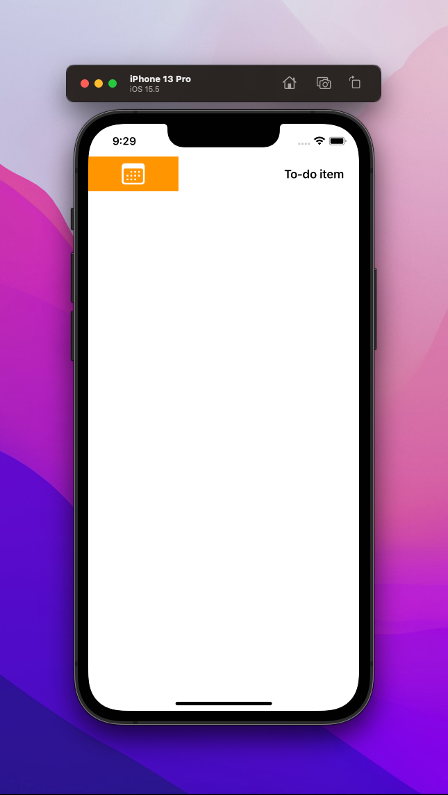

# ⚡️ SwiftUI Swipe Action

This repository contains the Swift UI code for a Swipe animation in iOS. It is very similar to the animation of list elements in iOS and is meant to show how you can use shortcuts via these swipe animations in a to-do list app, for example.

The code is based on documentation from SwiftUI and various YouTube tutorials and forum posts.

